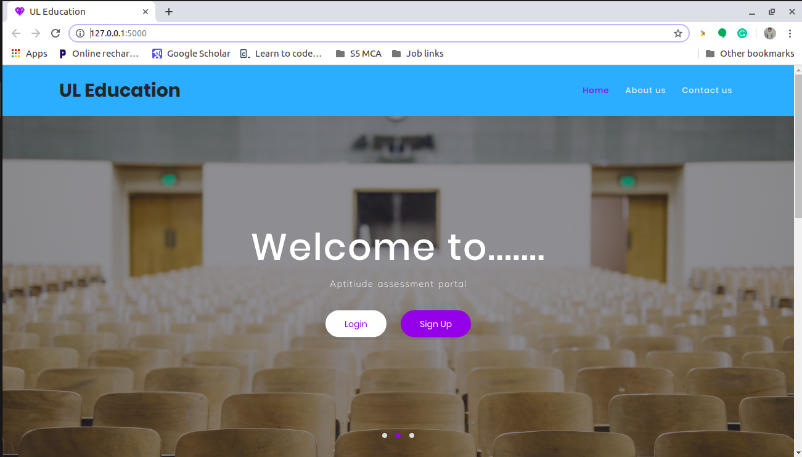
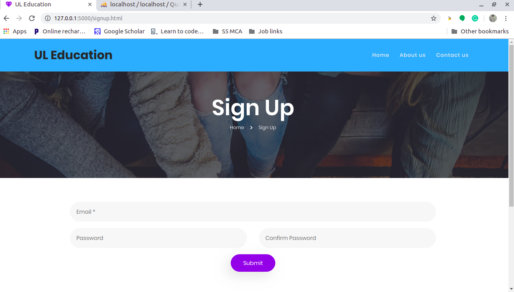
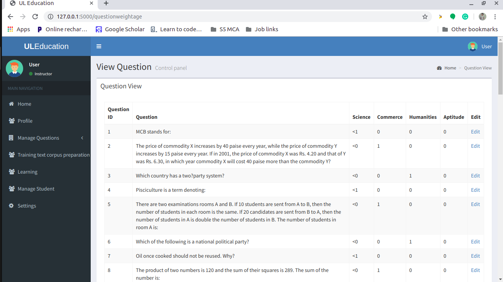
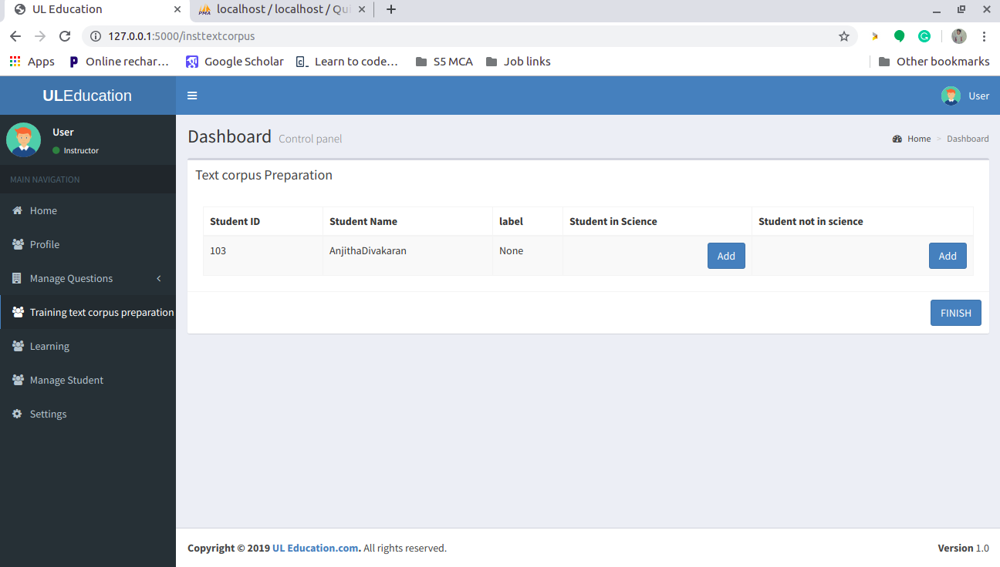
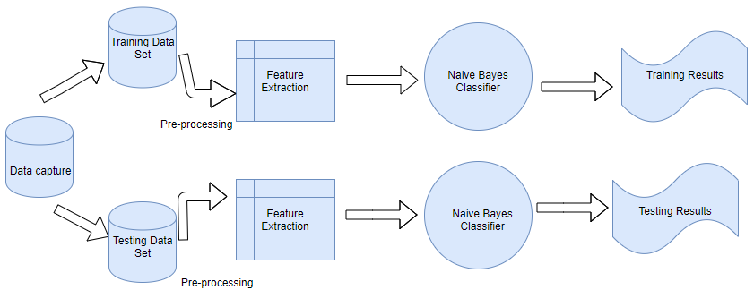
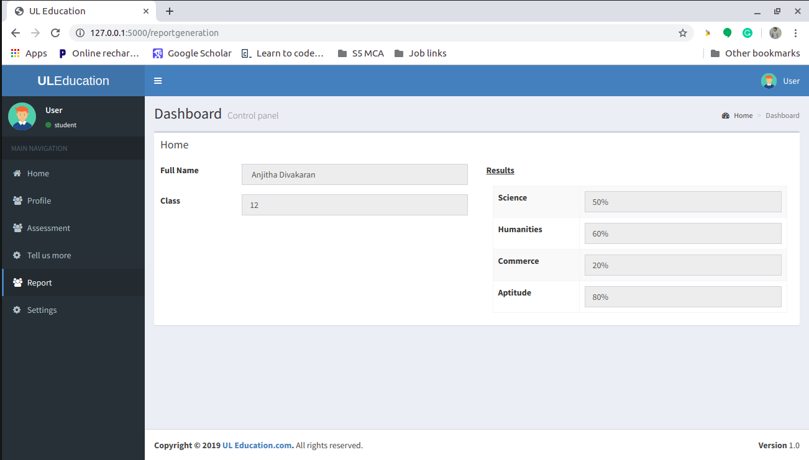
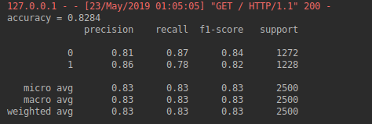

# Web Platform for Aptitude Assessment
A research oriented project that helps to understand the underlaying patterns of students interest and predict the stream that the student is interested in.

## Abstract
Understanding a students inherent aptitude is very crucial for an individual as well as an educational organisation. The project aims to create a web application
that enables the students to test their aptitude and generate a report accordingly. The project envisages additional components which can assess students attitude and
interest. Based on students attitude, aptitude and interest the application can point out the right kind of courses for the student. The application will be a web application developed using responsive web development technologies. Registration, answering questions and report viewing is the process flow from client side. Properly tagged and categorised database of questions is the backbone of the framework. The application needs to fetch and map appropriate questions from the database for each user. The application is accessible to only the students who have registered through the portal and they can attend the assessment and view and print the report and edit the profile. A data analytics framework will be developed during the second phase of the project. The set of questions compiled for the application is designed to understand the aptitude, attitude, and interest of a student. The data analytics framework will be used for exploring the underlying trend, patterns, and interconnections in the aptitude, attitude, and interest of a student. The tool is developed using the panda python framework. In the final phase of implementation, the developed tools will be integrated with direct classroom activities with the multimedia content developed by the organization.

## Scope of the project
1. Designed for educational purpose.
2. To study aptitude of student based on the scholastic aptitude of the student.
3. Analysing the pattern and underlying trends based on the student’s interest

## Sprint planning

According to this project, there are mainly two sprints, each one contains five and four user stories respectively.

- **Sprint 1: Assessement Applications**

- **Sprint 2: Evaluation and Data Analysis**

## Assessement Applications
This section of the project allows the registered students to attend the aptitude assessment. The student register through this portal fills the compulsory profile
and logs on to the application. The student can view the assessment report. This application also collects the interests and hobbies of students. The application allows
the instructor to prepare the set of questions. Assigning of questions to the students is done automatically, though the question paper is prepared by the instructor. It
also allows the instructor to manage students and also to edit their own profile. The instructor is registered by the administrator.

### How the Assessment System works?

All the questions are MCQ. Mainly four types of questions are supported by this application.

1. Normal MCQ questions.
2. Question with image and option
3. Question and option with images.
4. Question and option with images.

Questions can be from four main sections they are, Science, Commerce, Humanities, and Aptitude. Each question is prepared by the instructor. To prepare the question paper the instructor chooses about fifteen questions from each section. And one question paper contains sixty questions. The questions are given a weightage according to which the category that particular question falls. this weightage is made useful for the evaluation of students assessemnt.It is mandatory for the students to attend all the sixty question. Students need not complete the questions all at once and can continue as per their free time.

## ML Framework for Aptitude Development

### Text Corpus Preparation

A corpus is a file that contains all the text either in a single language or in multiple languages. The text corpus is prepared by the instructor. The instructor executes the command for preparation only when a large amount of data gets accumulated in the database. With the help of this data, we can classify the dataset into two: the training set and testing set.

### Pre-Processing PRE-PROCESSEING
The corpus that we get is raw data, which we cannot use directly for the classification purpose. In order to make the data useful for analyzing, we have to pre-process the text corpus. Pre-processing is a data technique that helps to convert the raw data into an understandable one. We perform all the basic pre-processing technique on the corpus and spilt the corpus into two datasets: training and testing data set. Text pre-processing is done in following ways:

1. Removing punctuations,
2. Casting all letters to lower case,
3. Stop word removal (the, a, an, etc.)
4. Removal of words that occur frequently
5. Spelling correction
6. Lemmatization

Stemming and lemmatization are part of text normalization. Lemmatization is preferred more than stemming because in the stemming process it might remove a word suffices, but in lemmatization, the word is converted to its root word.

### Naive Bayesian Classifer

**What is Naive Bayes Algorithm?**
Naive Bayes is a classification technique based on the Bayes Theory. In this theory, it is assumed that the features are independent of each other. The Naive Bayes Classifiers are linear Classifiers and are considered to be a simple and effective Classifier. All the assumption of this theory gets violated often, it still performs well in this assumption. Naive Bayes is extremely powerful for all type of data set.

## Results 

### Result for aptitude Assessment

The application is mainly built for the students to attend the aptitude assessment and view the final result of their assessment, In order to achieve this result the students have to first signup using an email and password. After the submiting, the student will be redirected to a compulsory profile completion where they has an option to confirm their registering or also to cancel their registration. The student if submitted the profile then they would be redirected to their workspace, where they can attend their examination. The student can only view the report after attending all the sixty questions allotted to them.The Report of the student will similar to the figure given above.

### Result for Machine Learning Framework

The text corpus is a large dataset. So to prepare a text corpus would take time as the data has to be accumulated in the database and the text corpus is prepared only when the database is full. To run machine learning Framework we are using the Amazon review dataset. It contains about 3.6M data. Pre-processing techniques like removing of punctuation, lemmatization, etc are done on the text corpus and it is split into two datasets namely, Training dataset and Testing dataset. Then count vector is taken as a feature from the training dataset. Count vector is a matrics representation of dataset where the row represents the documents from the corpus, the column represents the term from the document and each cell represent the number of occurrence of the term. This feature is then used for naive Bayes classification. By the training process, the accuracy of classification is expected to be 0.8284 with precision and recall have given in the figure below.

## Scope of further work 
This application developed in such a way that new components can be easily added without disturbing the overall structure. The application can be turned into a learning platform for Students, that provide online video classes to improve their knowledge. This helps the students to measure their literacy in a particular stream and to help in building up the literacy required for that stream if they didn’t perform well in the aptitude test. The application is now only available for students studying in the 10th and 12th standard. This application in the future could be made available for graduates for enhancing their skills in a particular field they are interested in.
